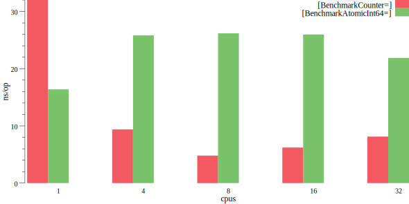
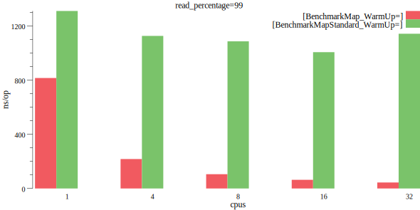
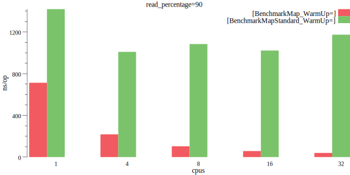
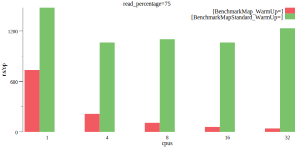
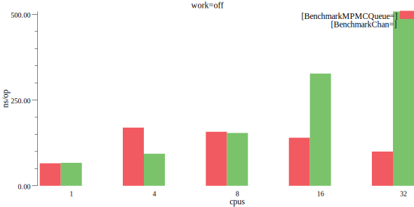
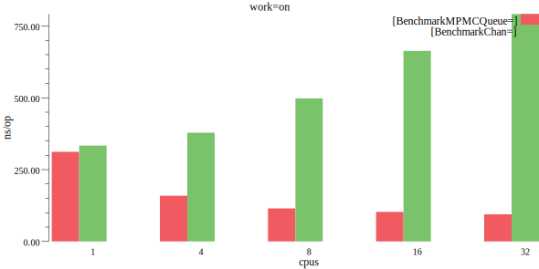
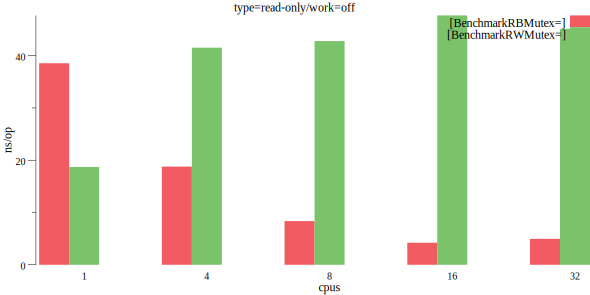

# xsync benchmarks

Use the following command to run the benchmarks:
```bash
$ go test -bench .
```

To limit the number of used CPU cores append `-cpu=<number>` argument to the above command.

This document contains some benchmark results obtained on a cloud VM.

### Counter vs. atomic int64

The following results were obtained on a GCP e2-highcpu-32 VM with 32 vCPUs (Intel Haswell), 32 GB memory, Ubuntu 20.04, Go 1.16.5.

<figure>
  
  <figcaption>Concurrent incs/decs, a value read on each 10,000 modification</figcaption>
</figure>

### Map vs. sync.Map

The following results were obtained on a GCP e2-highcpu-32 VM with 32 vCPUs (Intel Haswell), 32 GB memory, Ubuntu 20.04, Go 1.16.5.

<figure>
  
  <figcaption>1M entries with warm-up, 99% Loads, 0.5% Stores, 0.5% Deletes</figcaption>
</figure>

<br/><br/>

<figure>
  
  <figcaption>1M entries with warm-up, 90% Loads, 5% Stores, 5% Deletes</figcaption>
</figure>

<br/><br/>

<figure>
  
  <figcaption>1M entries with warm-up, 75% Loads, 12.5% Stores, 12.5% Deletes</figcaption>
</figure>

### MPMCQueue vs. Go channels

The following results were obtained on a GCP e2-highcpu-32 VM with 32 vCPUs (Intel Haswell), 32 GB memory, Ubuntu 20.04, Go 1.16.5.

<figure>
  
  <figcaption>Concurrent producers and consumers (1:1), queue/channel size 1,000, no work</figcaption>
</figure>

<br/><br/>

<figure>
  
  <figcaption>Concurrent producers and consumers (1:1), queue/channel size 1,000, some work</figcaption>
</figure>

### RBMutex vs. sync.RWMutex

The following results were obtained on a GCP e2-highcpu-32 VM with 32 vCPUs (Intel Haswell), 32 GB memory, Ubuntu 20.04, Go 1.16.5.

<figure>
  
  <figcaption>Reader locks only, no work in the critical section</figcaption>
</figure>

<br/><br/>

<figure>
  
  <figcaption>Reader locks only, some work in the critical section</figcaption>
</figure>

<br/><br/>

<figure>
  
  <figcaption>Writer locks on each 10,000 iteration, both no work and some work in the critical section</figcaption>
</figure>
