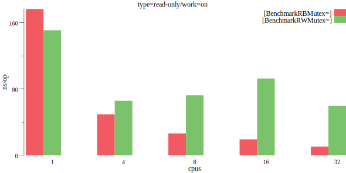
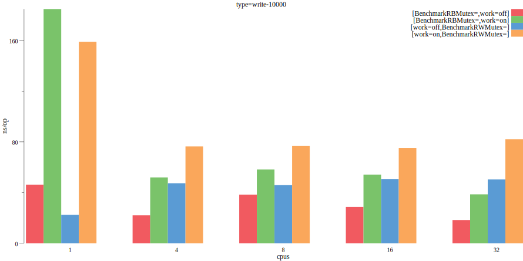

# xsync

Concurrent data structures for Go. An extension for the standard `sync` package.

## RBMutex

A `RBMutex` is a reader biased reader/writer mutual exclusion lock. The lock can be held by an many readers or a single writer.

```go
var m RBMutex
// reader lock calls return a token
t := m.RLock()
// the token must be later used to unlock the mutex
m.RUnlock(t)
// writer locks are the same as in sync.RWMutex
m.Lock()
m.Unlock()
```

`RBMutex` is based on the BRAVO (Biased Locking for Reader-Writer Locks) algorithm: https://arxiv.org/pdf/1810.01553.pdf

`RBMutex` is a specialized mutex for scenarios, such as caches, where the vast majority of locks are acquired by readers and write lock acquire attempts are infrequent. In such scenarios, `RBMutex` should perform better than the sync.RWMutex on large multicore machines.

`RBMutex` extends `sync.RWMutex` internally and uses it as the "reader bias disabled" fallback, so the same semantics apply. The only noticeable difference is in reader tokens returned from the `RLock`/`RUnlock` methods.

### RBMutex vs. sync.RWMutex

The following results were obtained on a GCP e2-highcpu-32 VM with 32 vCPUs (Intel Haswell), 32 GB memory, Ubuntu 20.04, Go 1.16.5.

<figure>
  
  <figcaption>Reader locks only, no work in the critical section</figcaption>
</figure>

<br/><br/>

<figure>
  
  <figcaption>Reader locks only, a loop spin in the critical section</figcaption>
</figure>

<br/><br/>

<figure>
  
  <figcaption>Writer locks on each 10,000 iteration, both no work and a loop spin in the critical section</figcaption>
</figure>

<br/><br/>

Full benchmark run output:
```bash
$ go test -cpu 1,4,8,16,32 -bench .
goos: linux
goarch: amd64
pkg: github.com/puzpuzpuz/xsync
cpu: Intel(R) Xeon(R) CPU @ 2.30GHz
BenchmarkRBMutexReadOnly             	26313470	        38.55 ns/op
BenchmarkRBMutexReadOnly-4           	58114323	        18.78 ns/op
BenchmarkRBMutexReadOnly-8           	129957759	         8.358 ns/op
BenchmarkRBMutexReadOnly-16          	241634568	         4.215 ns/op
BenchmarkRBMutexReadOnly-32          	250252396	         4.957 ns/op
BenchmarkRBMutexWrite10000           	25394166	        46.26 ns/op
BenchmarkRBMutexWrite10000-4         	54481448	        22.03 ns/op
BenchmarkRBMutexWrite10000-8         	45259827	        38.40 ns/op
BenchmarkRBMutexWrite10000-16        	46214970	        28.64 ns/op
BenchmarkRBMutexWrite10000-32        	75686509	        18.31 ns/op
BenchmarkRBMutexWrite1000            	18588454	        64.69 ns/op
BenchmarkRBMutexWrite1000-4          	20776155	        55.37 ns/op
BenchmarkRBMutexWrite1000-8          	21923694	        61.02 ns/op
BenchmarkRBMutexWrite1000-16         	22433272	        52.90 ns/op
BenchmarkRBMutexWrite1000-32         	26711444	        47.37 ns/op
BenchmarkRBMutexWrite100             	12626133	        95.10 ns/op
BenchmarkRBMutexWrite100-4           	11943140	       102.3 ns/op
BenchmarkRBMutexWrite100-8           	11523394	       102.9 ns/op
BenchmarkRBMutexWrite100-16          	11974585	       101.8 ns/op
BenchmarkRBMutexWrite100-32          	10757925	       101.1 ns/op
BenchmarkRBMutexWorkReadOnly         	 6799182	       176.5 ns/op
BenchmarkRBMutexWorkReadOnly-4       	25056453	        49.31 ns/op
BenchmarkRBMutexWorkReadOnly-8       	43928162	        26.37 ns/op
BenchmarkRBMutexWorkReadOnly-16      	63493318	        19.26 ns/op
BenchmarkRBMutexWorkReadOnly-32      	115358217	        10.52 ns/op
BenchmarkRBMutexWorkWrite10000       	 6489256	       184.8 ns/op
BenchmarkRBMutexWorkWrite10000-4     	22903074	        51.95 ns/op
BenchmarkRBMutexWorkWrite10000-8     	18768334	        58.23 ns/op
BenchmarkRBMutexWorkWrite10000-16    	24756772	        54.18 ns/op
BenchmarkRBMutexWorkWrite10000-32    	29193343	        38.58 ns/op
BenchmarkRBMutexWorkWrite1000        	 6159172	       194.7 ns/op
BenchmarkRBMutexWorkWrite1000-4      	11008384	       104.7 ns/op
BenchmarkRBMutexWorkWrite1000-8      	 7038783	       148.1 ns/op
BenchmarkRBMutexWorkWrite1000-16     	 8232370	       138.3 ns/op
BenchmarkRBMutexWorkWrite1000-32     	12456228	       105.8 ns/op
BenchmarkRBMutexWorkWrite100         	 5034212	       237.8 ns/op
BenchmarkRBMutexWorkWrite100-4       	 5191148	       231.4 ns/op
BenchmarkRBMutexWorkWrite100-8       	 5284609	       234.2 ns/op
BenchmarkRBMutexWorkWrite100-16      	 5599806	       221.6 ns/op
BenchmarkRBMutexWorkWrite100-32      	 5914454	       202.3 ns/op
BenchmarkRWMutexReadOnly             	64022180	        18.70 ns/op
BenchmarkRWMutexReadOnly-4           	31927851	        41.53 ns/op
BenchmarkRWMutexReadOnly-8           	27483433	        42.79 ns/op
BenchmarkRWMutexReadOnly-16          	28029363	        47.70 ns/op
BenchmarkRWMutexReadOnly-32          	23153505	        45.13 ns/op
BenchmarkRWMutexWrite10000           	53393175	        22.47 ns/op
BenchmarkRWMutexWrite10000-4         	24887362	        47.36 ns/op
BenchmarkRWMutexWrite10000-8         	27977808	        45.97 ns/op
BenchmarkRWMutexWrite10000-16        	22559613	        50.71 ns/op
BenchmarkRWMutexWrite10000-32        	23364820	        50.39 ns/op
BenchmarkRWMutexWrite1000            	53236329	        22.52 ns/op
BenchmarkRWMutexWrite1000-4          	29751771	        39.30 ns/op
BenchmarkRWMutexWrite1000-8          	35236100	        30.89 ns/op
BenchmarkRWMutexWrite1000-16         	27672891	        43.30 ns/op
BenchmarkRWMutexWrite1000-32         	20397919	        54.79 ns/op
BenchmarkRWMutexWrite100             	52899360	        22.69 ns/op
BenchmarkRWMutexWrite100-4           	43830064	        31.80 ns/op
BenchmarkRWMutexWrite100-8           	38807470	        31.49 ns/op
BenchmarkRWMutexWrite100-16          	33015915	        30.90 ns/op
BenchmarkRWMutexWrite100-32          	27893749	        39.51 ns/op
BenchmarkRWMutexWorkReadOnly         	 7945802	       150.9 ns/op
BenchmarkRWMutexWorkReadOnly-4       	18171207	        65.84 ns/op
BenchmarkRWMutexWorkReadOnly-8       	19381813	        72.50 ns/op
BenchmarkRWMutexWorkReadOnly-16      	16162077	        92.70 ns/op
BenchmarkRWMutexWorkReadOnly-32      	20551755	        59.54 ns/op
BenchmarkRWMutexWorkWrite10000       	 7545424	       158.9 ns/op
BenchmarkRWMutexWorkWrite10000-4     	16967394	        76.46 ns/op
BenchmarkRWMutexWorkWrite10000-8     	16362222	        76.78 ns/op
BenchmarkRWMutexWorkWrite10000-16    	15148587	        75.29 ns/op
BenchmarkRWMutexWorkWrite10000-32    	16342450	        82.11 ns/op
BenchmarkRWMutexWorkWrite1000        	 7528286	       158.8 ns/op
BenchmarkRWMutexWorkWrite1000-4      	12558568	        92.80 ns/op
BenchmarkRWMutexWorkWrite1000-8      	10088085	       122.6 ns/op
BenchmarkRWMutexWorkWrite1000-16     	12420112	       105.1 ns/op
BenchmarkRWMutexWorkWrite1000-32     	12869764	        98.63 ns/op
BenchmarkRWMutexWorkWrite100         	 7602496	       158.0 ns/op
BenchmarkRWMutexWorkWrite100-4       	 7605056	       157.2 ns/op
BenchmarkRWMutexWorkWrite100-8       	 7274314	       165.7 ns/op
BenchmarkRWMutexWorkWrite100-16      	 7248856	       166.2 ns/op
BenchmarkRWMutexWorkWrite100-32      	 7485189	       162.2 ns/op
```

## License

Licensed under MIT.
